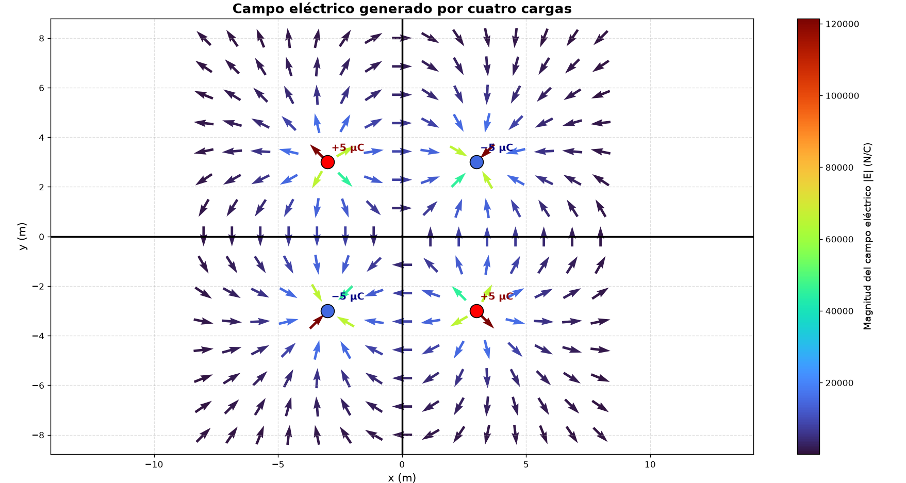

# ⚡ Visualización del Campo Eléctrico de un Arreglo de Cuatro Cargas Puntuales

Simulación computacional del campo eléctrico generado por un arreglo de cuatro cargas puntuales utilizando **Python**, **NumPy** y **Matplotlib**.

Este proyecto fue desarrollado como parte de un laboratorio de **Física II - Electromagnetismo**, con el objetivo de calcular y visualizar el campo eléctrico mediante el principio de superposición.

---

## 📖 Descripción

Se modeló un sistema compuesto por cuatro cargas puntuales de igual magnitud y signos alternados, distribuidas simétricamente sobre el plano cartesiano.

Las cargas utilizadas fueron:

| Carga | Posición (m) | Valor |
|:-----:|:------------:|:------:|
| $q_1$ | $(-3,\;3)$ | $+5\,\mu C$ |
| $q_2$ | $(3,\;3)$ | $-5\,\mu C$ |
| $q_3$ | $(-3,\;-3)$ | $-5\,\mu C$ |
| $q_4$ | $(3,\;-3)$ | $+5\,\mu C$ |

La separación entre cargas adyacentes es **6 m**, y el origen del sistema de coordenadas coincide con el centro del arreglo.

---

## ⚙️ Fundamento físico

El campo eléctrico producido por una carga puntual está dado por

$$
\vec{E}=k\frac{q}{r^{3}}\vec{r},
$$

donde

- $k$ es la constante de Coulomb.
- $q$ es la carga eléctrica.
- $\vec r$ es el vector que une la carga con el punto de observación.

El campo eléctrico total se obtiene mediante el principio de superposición:

$$
\vec{E}_{total}=\sum_{i=1}^{4}\vec{E}_i.
$$

---

## 🖥️ Tecnologías utilizadas

- Python 3
- NumPy
- Matplotlib

---

## 📂 Estructura del proyecto

```text
campo-electrico-cuatro-cargas/

│── campo.py
│── requirements.txt
│── README.md
│── campo.png
└── .gitignore
```

---

## ▶️ Cómo ejecutar el proyecto

### 1. Clonar el repositorio

```bash
git clone https://github.com/ValeRoyal/Visualizacion-del-Campo-Electrico-de-un-Arreglo-de-Cuatro-Cargas-Puntuales.git
```

### 2. Entrar al proyecto

```bash
cd campo-electrico-cuatro-cargas
```

### 3. Crear un entorno virtual

```bash
python -m venv venv
```

### 4. Activarlo

En Windows:

```bash
venv\Scripts\activate
```

En Linux o macOS:

```bash
source venv/bin/activate
```

### 5. Instalar las dependencias

```bash
pip install -r requirements.txt
```

### 6. Ejecutar el programa

```bash
python campo.py
```

---

## 📊 Resultado esperado

El programa genera una representación gráfica del campo eléctrico mediante un campo vectorial utilizando la función **quiver()** de Matplotlib.

La visualización incluye:

- Campo vectorial normalizado.
- Escala de colores para la magnitud del campo.
- Identificación de cargas positivas y negativas.
- Ejes cartesianos resaltados.
- Cuadrícula para facilitar la interpretación.
  
---
## 📊 Resultado



---

## 👩‍💻 Autora

**Valentina Aguilar Perdomo**

---

## 📚 Referencias

- Halliday, Resnick & Walker. *Fundamentals of Physics*.
- Serway & Jewett. *Physics for Scientists and Engineers*.
- Documentación oficial de NumPy.
- Documentación oficial de Matplotlib.

---

## ⭐ Licencia

Este proyecto fue desarrollado con fines académicos y educativos.
